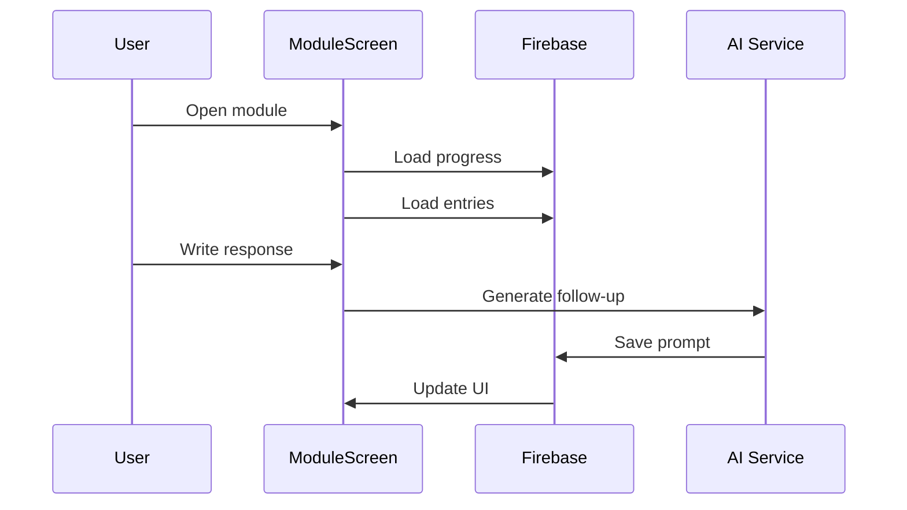
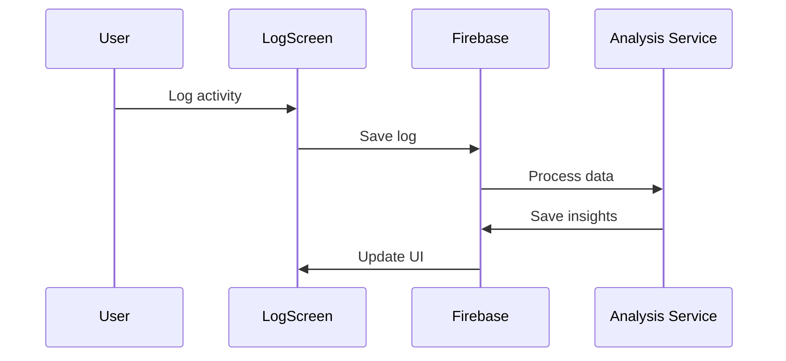

# System Architecture

## Overview

Interosight is built as a modern single-page application (SPA) using React and TypeScript, with Firebase providing backend services. The architecture emphasizes type safety, modular design, and efficient state management.

## Technology Stack

### Frontend
- React 18+ with TypeScript
- Vite for build tooling
- TailwindCSS for styling
- React Router for navigation

### Backend Services
- Firebase Authentication
- Cloud Firestore
- Google AI Studio (Gemini API)

### Development Tools
- ESLint + Prettier
- Jest + React Testing Library
- GitHub Actions for CI/CD

## Core Components

### 1. Module System
```typescript
// Core module types and progression logic
src/
├── data/
│   └── modules.ts         // Static module definitions
├── services/
│   └── moduleService.ts   // Module progression logic
└── screens/
    └── ModuleScreen.tsx   // Module interaction UI
```

### 2. Journal System
```typescript
// Journaling features and AI integration
src/
├── services/
│   ├── journalService.ts  // Entry management
│   └── aiService.ts       // AI integration
└── screens/
    ├── ModuleScreen.tsx   // Structured journaling
    └── FreeformScreen.tsx // Freeform journaling
```

### 3. Activity Tracking
```typescript
// Behavior and emotion tracking
src/
├── services/
│   └── activityService.ts // Logging and analysis
└── screens/
    └── LogScreen.tsx      // Activity logging UI
```

## State Management

### 1. Authentication Context
```typescript
interface AuthState {
  currentUser: User | null;
  loading: boolean;
  error: Error | null;
}

const AuthContext = createContext<AuthContextType | null>(null);
```

### 2. Module Context
```typescript
interface ModuleState {
  currentModule: Module | null;
  progress: ModuleProgress | null;
  entries: JournalEntry[];
}

const ModuleContext = createContext<ModuleContextType | null>(null);
```

### 3. Activity Context
```typescript
interface ActivityState {
  recentLogs: Array<MealLog | BehaviorLog>;
  insights: Insight[];
  loading: boolean;
}

const ActivityContext = createContext<ActivityContextType | null>(null);
```

## Data Flow

### 1. Module Interaction


### 2. Activity Logging


## Security Model

### 1. Authentication
- Firebase Authentication
- Protected routes
- Session management

### 2. Data Access
- Per-user data isolation
- Collection-level security
- Write validation

### 3. API Security
- Environment variables
- API key management
- Request validation

## Error Handling

### 1. UI Errors
- Error boundaries
- Toast notifications
- Fallback UI states

### 2. API Errors
- Retry logic
- Error classification
- Graceful degradation

### 3. Data Validation
- Schema validation
- Input sanitization
- Type checking

## Performance

### 1. Loading States
- Skeleton screens
- Progressive loading
- Optimistic updates

### 2. Data Caching
- Firebase offline persistence
- React Query caching
- Local storage

### 3. Code Splitting
- Route-based splitting
- Component lazy loading
- Dynamic imports

## Development Guidelines

### 1. Code Organization
- Feature-based structure
- Clear separation of concerns
- Consistent naming

### 2. Type Safety
- Strict TypeScript
- Exhaustive checks
- Interface definitions

### 3. Testing
- Unit tests
- Integration tests
- E2E testing

## Deployment

### 1. Environment Setup
- Development
- Staging
- Production

### 2. CI/CD Pipeline
- Automated testing
- Build optimization
- Deployment automation

### 3. Monitoring
- Error tracking
- Performance monitoring
- Usage analytics 