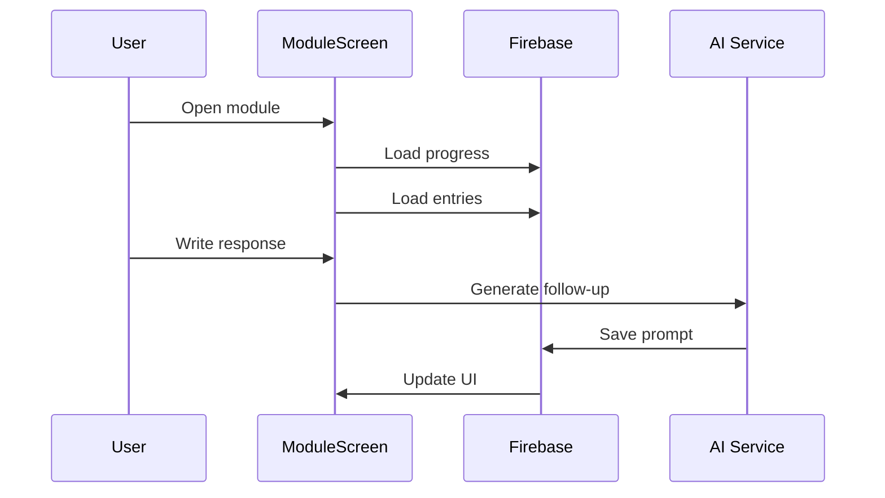
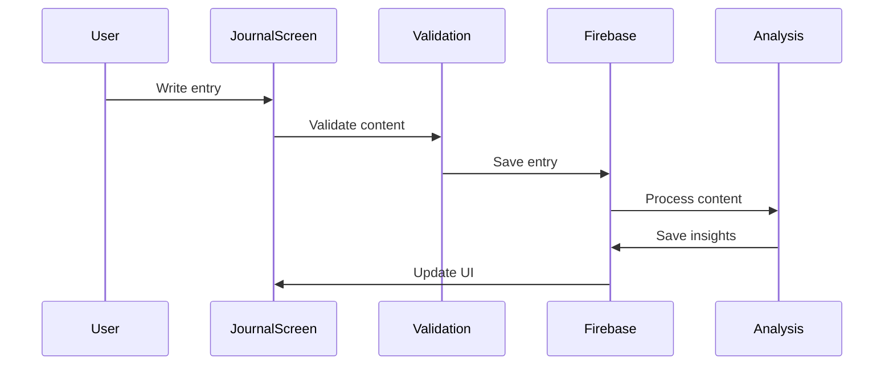
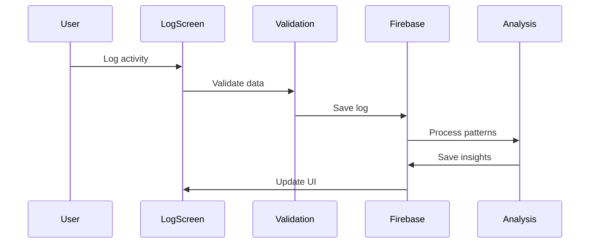

# Data Flow

## Overview

This document describes the data flow patterns in Interosight, covering state management, API integration, and event handling.

## State Management

### Authentication State
```typescript
// AuthContext manages user authentication state
interface AuthState {
  currentUser: User | null;
  loading: boolean;
  error: Error | null;
}

// Usage in components
const { currentUser, loading } = useAuth();
```

### Module State
```typescript
// ModuleContext manages current module state
interface ModuleState {
  currentModule: Module | null;
  progress: ModuleProgress | null;
  entries: JournalEntry[];
}

// Usage in components
const { currentModule, progress } = useModule();
```

### Activity State
```typescript
// ActivityContext manages logging state
interface ActivityState {
  recentLogs: Array<MealLog | BehaviorLog>;
  insights: Insight[];
  loading: boolean;
}

// Usage in components
const { recentLogs, insights } = useActivity();
```

## Data Flow Patterns

### 1. Module Interaction


### 2. Journal Entry


### 3. Activity Logging


## API Integration

### 1. Google AI Studio (Gemini)
```typescript
// AI service configuration
const genAI = new GoogleGenerativeAI(API_KEY);
const model = genAI.getGenerativeModel({ model: 'gemini-pro' });

// Prompt generation
const generatePrompt = async (params: GeneratePromptParams) => {
  const chat = model.startChat({
    history: buildHistory(params),
    safetySettings: SAFETY_SETTINGS
  });
  return chat.sendMessage(params.content);
};
```

### 2. Firebase Integration
```typescript
// Database operations
const createEntry = async (entry: JournalEntry) => {
  const entryRef = collection(db, 'users', userId, 'entries');
  return addDoc(entryRef, {
    ...entry,
    createdAt: serverTimestamp()
  });
};

// Real-time updates
const subscribeToUpdates = (callback: (data: any) => void) => {
  const query = collection(db, 'users', userId, 'updates');
  return onSnapshot(query, callback);
};
```

## Event Handling

### 1. User Interactions
```typescript
// Form submissions
const handleSubmit = async (data: FormData) => {
  try {
    await validateData(data);
    await saveData(data);
    updateUI();
  } catch (error) {
    handleError(error);
  }
};

// Real-time updates
useEffect(() => {
  const unsubscribe = subscribeToUpdates(handleUpdate);
  return () => unsubscribe();
}, []);
```

### 2. Error Handling
```typescript
// Error boundaries
class ErrorBoundary extends React.Component {
  componentDidCatch(error: Error, info: ErrorInfo) {
    logError(error, info);
    showErrorUI();
  }
}

// API error handling
const handleAPIError = (error: APIError) => {
  if (error.retryable) {
    return retryOperation();
  }
  showErrorMessage(error);
};
```

### 3. State Updates
```typescript
// Optimistic updates
const updateEntry = async (id: string, data: Partial<Entry>) => {
  // Update local state immediately
  updateLocalState(id, data);
  
  try {
    // Update backend
    await saveToBackend(id, data);
  } catch (error) {
    // Revert on failure
    revertLocalState(id);
    handleError(error);
  }
};
```

## Performance Considerations

### 1. Data Loading
- Implement pagination
- Use infinite scrolling
- Cache frequently accessed data
- Prefetch likely-to-be-needed data

### 2. State Updates
- Batch updates when possible
- Use optimistic updates
- Debounce frequent changes
- Memoize expensive calculations

### 3. Real-time Updates
- Use appropriate subscription patterns
- Implement reconnection logic
- Handle offline scenarios
- Manage subscription cleanup

## Best Practices

### 1. State Management
- Keep state close to where it's used
- Use appropriate context boundaries
- Implement proper cleanup
- Handle loading states

### 2. Error Handling
- Implement proper error boundaries
- Provide meaningful error messages
- Handle offline scenarios
- Log errors appropriately

### 3. Performance
- Monitor performance metrics
- Optimize render cycles
- Implement proper caching
- Handle large datasets efficiently 