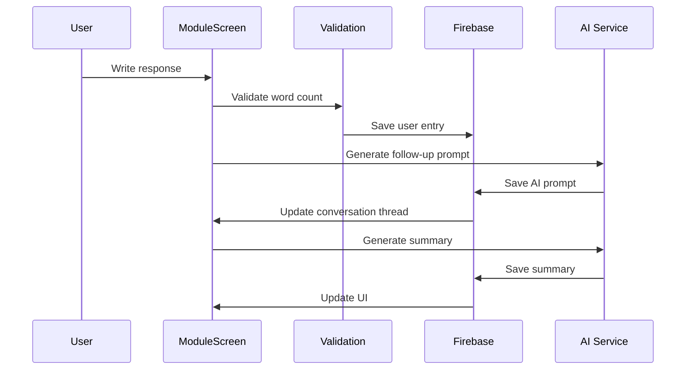
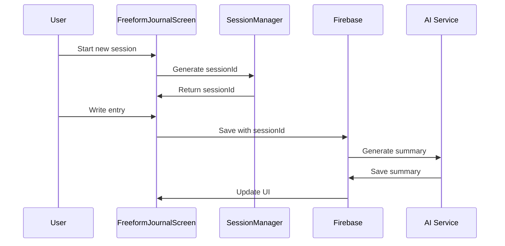
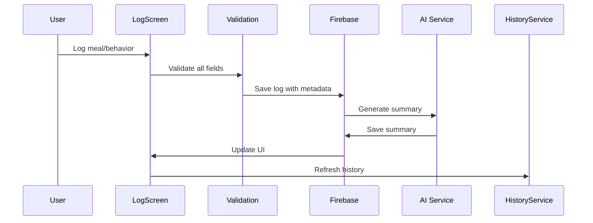
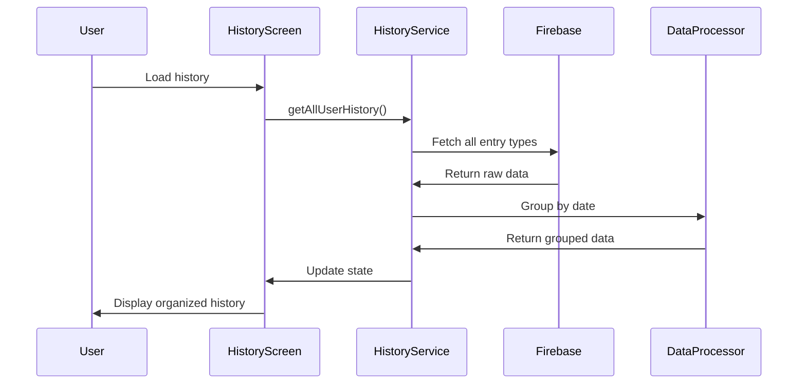
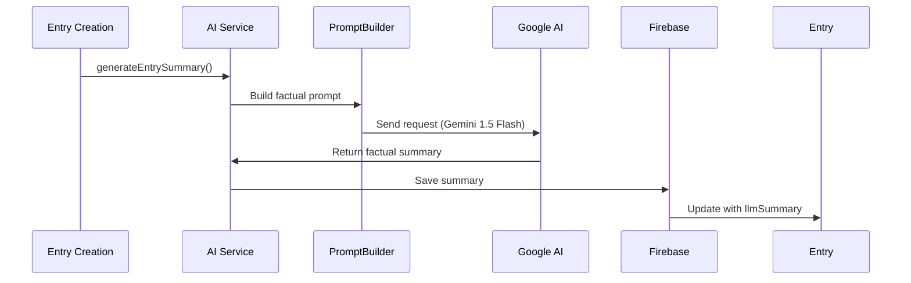

# Data Flow

## Overview

This document describes the data flow patterns in Interosight, covering state management, API integration, and event handling. The system now includes comprehensive history management, AI-powered summaries, and session-based data isolation.

## State Management

### Authentication State
```typescript
// AuthContext manages user authentication state
interface AuthState {
  currentUser: User | null;
  loading: boolean;
  error: Error | null;
}

// Usage in components
const { currentUser, loading } = useAuth();
```

### Module State
```typescript
// ModuleContext manages current module state
interface ModuleState {
  currentModule: Module | null;
  progress: ModuleProgress | null;
  entries: JournalEntry[];
}

// Usage in components
const { currentModule, progress } = useModule();
```

### Activity State
```typescript
// ActivityContext manages logging state
interface ActivityState {
  recentLogs: Array<MealLog | BehaviorLog>;
  insights: Insight[];
  loading: boolean;
}

// Usage in components
const { recentLogs, insights } = useActivity();
```

### History State
```typescript
// HistoryContext manages history data
interface HistoryState {
  groupedEntries: GroupedHistoryEntries[];
  selectedTimeframe: '7d' | '30d' | '90d';
  loading: boolean;
  error: string | null;
}

// Usage in components
const { groupedEntries, selectedTimeframe } = useHistory();
```

## Data Flow Patterns

### 1. Module Interaction with AI


### 2. Freeform Journaling with Session Isolation


### 3. Activity Logging with Pre/Post Data


### 4. History Aggregation and Display


### 5. AI Summary Generation


## API Integration

### 1. Google AI Studio (Gemini)
```typescript
// AI service configuration with dual models
const followUpModelConfig = {
  model: "gemma-3-12b-it", // Cost-effective for follow-up prompts
  generationConfig: {
    temperature: 0.7,
    topP: 0.8,
    topK: 40,
    maxOutputTokens: 200,
  }
};

const summaryModelConfig = {
  model: "gemini-1.5-flash", // Powerful for clinical summaries
  generationConfig: {
    temperature: 0.3, // Lower temperature for consistent factual analysis
    topP: 0.9,
    topK: 40,
    maxOutputTokens: 150, // Shorter for 30-word summaries
  }
};

// Factual summary generation
const generateEntrySummary = async (params: GenerateSummaryParams) => {
  const systemPrompt = buildFactualPrompt(params.entryType);
  const userPrompt = buildUserPrompt(params.content, params.metadata);
  const result = await summaryModel.generateContent(`${systemPrompt}\n\n${userPrompt}`);
  return result.response.text();
};
```

### 2. Firebase Firestore
```typescript
// Firestore service patterns
interface FirebaseService {
  // User data
  createUserProfile(userId: string, profile: UserProfile): Promise<void>;
  getUserProfile(userId: string): Promise<UserProfile | null>;
  
  // Module data
  createModuleEntry(userId: string, moduleId: string, entry: JournalEntry): Promise<string>;
  getModuleEntries(userId: string, moduleId: string): Promise<JournalEntry[]>;
  updateModuleProgress(userId: string, moduleId: string, progress: ModuleProgress): Promise<void>;
  
  // Freeform journaling
  createFreeformEntry(userId: string, content: string, sessionId: string): Promise<string>;
  getFreeformEntries(userId: string, sessionId?: string): Promise<FreeformEntry[]>;
  
  // Activity logging
  createMealLog(log: MealLog): Promise<string>;
  createBehaviorLog(log: BehaviorLog): Promise<string>;
  getMealLogs(userId: string): Promise<MealLog[]>;
  getBehaviorLogs(userId: string): Promise<BehaviorLog[]>;
  
  // History aggregation
  getAllUserHistory(userId: string): Promise<GroupedHistoryEntries[]>;
}
```

## Data Models

### 1. Journal Entries
```typescript
interface JournalEntry {
  id: string;
  userId: string;
  moduleId: string;
  submoduleId: string;
  content: string;
  type: 'user_response' | 'ai_prompt';
  chainPosition: number;
  parentEntryId?: string;
  conversationThread: ConversationMessage[];
  llmSummary?: string;
  createdAt: Timestamp;
  updatedAt: Timestamp;
}

interface FreeformEntry {
  id: string;
  userId: string;
  content: string;
  sessionId: string;
  chainPosition: number;
  parentEntryId?: string;
  conversationThread: ConversationMessage[];
  llmSummary?: string;
  createdAt: Timestamp;
  updatedAt: Timestamp;
}
```

### 2. Activity Logs
```typescript
interface MealLog {
  id: string;
  userId: string;
  mealType: string;
  description: string;
  satietyPre: number;
  satietyPost: number;
  emotionPre: string[];
  emotionPost: string[];
  affectPre: number;
  affectPost: number;
  location: string;
  socialContext: string;
  llmSummary?: string;
  createdAt: Timestamp;
}

interface BehaviorLog {
  id: string;
  userId: string;
  description: string;
  emotionPre: string[];
  emotionPost: string[];
  affectPre: number;
  affectPost: number;
  llmSummary?: string;
  createdAt: Timestamp;
}
```

### 3. History Aggregation
```typescript
interface HistoryEntry {
  id: string;
  type: 'freeform' | 'module' | 'meal' | 'behavior';
  title: string;
  description: string;
  content: string;
  llmSummary?: string;
  createdAt: Date;
  metadata: {
    wordCount: number;
    emotions?: string[];
    moduleId?: string;
    mealType?: string;
    location?: string;
    socialContext?: string;
    satietyPre?: number;
    satietyPost?: number;
    emotionPre?: string[];
    emotionPost?: string[];
    affectPre?: number;
    affectPost?: number;
    conversationThread?: ConversationMessage[];
  };
}

interface GroupedHistoryEntries {
  date: string;
  entries: HistoryEntry[];
}
```

## Error Handling

### 1. AI Service Errors
```typescript
// Graceful fallback for AI failures
const generateSummary = async (content: string, entryType: string) => {
  try {
    return await generateEntrySummary({ content, entryType });
  } catch (error) {
    console.error('AI summary generation failed:', error);
    return content.substring(0, 100) + '...'; // Fallback preview
  }
};
```